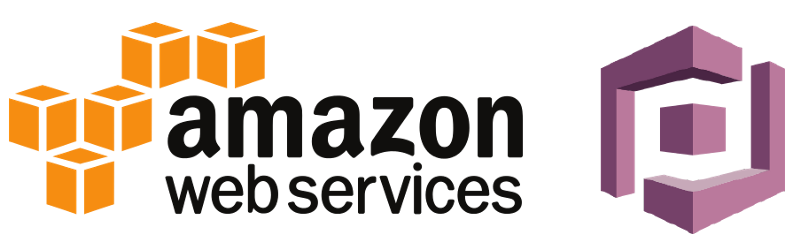

# Public Todo List - Social Network

This project is a small social network built upon the TODO example provided by Amplify as a demo application. The project includes significant enhancements to understand better the GEN 2 of Amplify and its integration with AWS services. It offers a deeper understanding of models and their interaction with GraphQL, showcasing practical use cases and advanced features of Amplify. 

Developed with Next.JS (App Router) and AWS Amplify.

## Features

- **Authentication**: Setup with Amazon Cognito for secure user authentication.

- **API**: Ready-to-use GraphQL endpoint with AWS AppSync.

- **Database**: Real-time database powered by Amazon DynamoDB.

## Deploying to AWS

Deploying this project is straightforward. Follow the steps outlined in the [initial example project](https://docs.amplify.aws/nextjs/start/quickstart/nextjs-app-router-client-components/#deploy-a-fullstack-app-to-aws), but use this repository as the template instead.

## DEMO

### [List Social](https://main.d228j8ylytiys6.amplifyapp.com/en/home)

## License

This library is licensed under the GNU General Public License v3.0. See the LICENSE file.